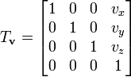
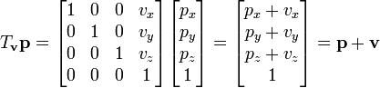

A transformation maps points in space to other points. Translation moves every point by a constant distance in a constant direction. This can be interpreted as the addition of a constant vector to every point. If homogeneous representation is used, translation can be conveniently represented as a matrix multiplication. The translation matrix which translates by vx, vy and v z units looks like:

On multiplication with a vector, the expected result of vector addition is obtained:
Matrix representation for Point translation

Transformations can be interpreted as the modification of a co-ordinate system, keeping the points constant, effectively changing their relative positions. Thus, a translation of (2,3) translates the co-ordinate system's origin to (-2,-3), effectively translating all points with respect to this co-ordinate system.
